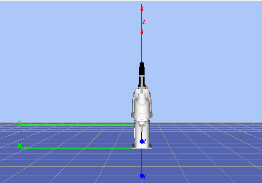
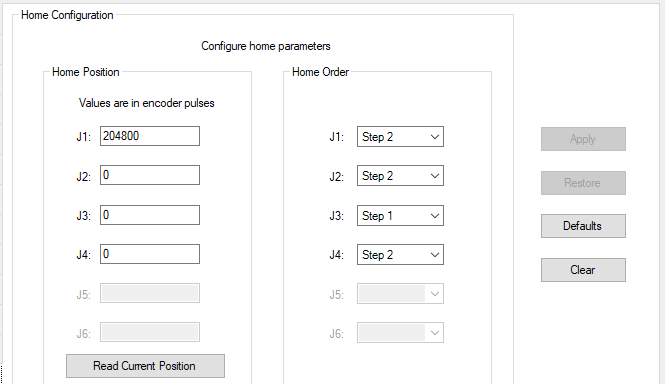
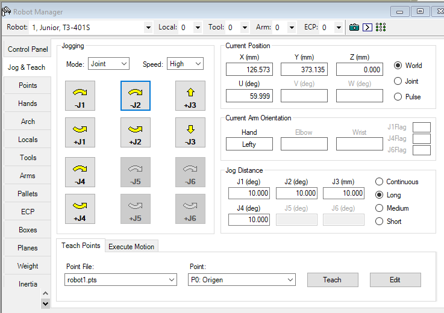
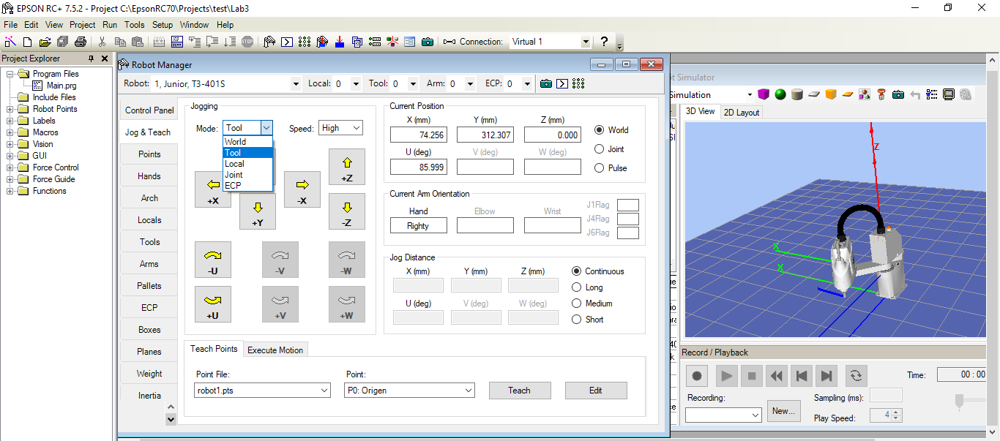
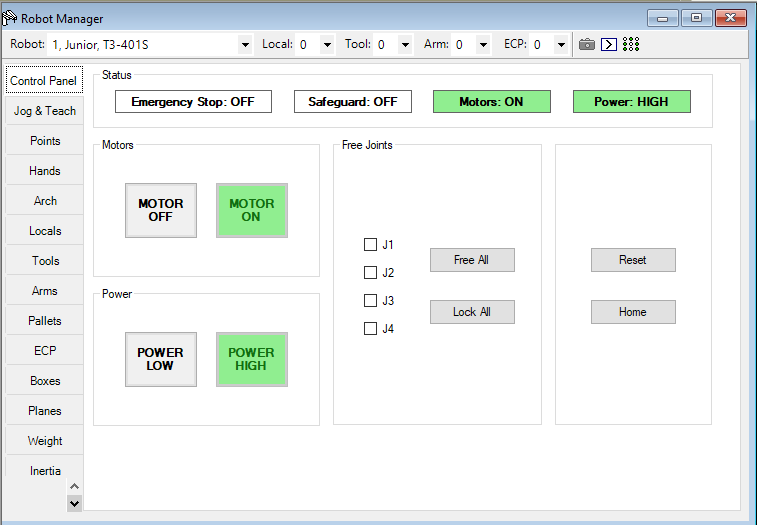

# Laboratorio No. 3 – Robótica Industrial – Análisis y Operación del Manipulador EPSON T3-401S

## Integrantes

* Sergio Andrés Bolaños Penagos
* Sergio Felipe Rodriguez Mayorga

## Introducción
En esta práctica se trabajó con el manipulador industrial **EPSON T3-401S**, lo que permitió ampliar la experiencia adquirida previamente en los laboratorios con robots ABB y Yaskawa, incorporando ahora un entorno de programación distinto mediante el software **EPSON RC+ 7.0**.

El objetivo principal del laboratorio consistió en implementar una rutina de **paletizado sobre una matriz 6×5** (una cubeta de huevos), utilizando tanto la definición geométrica del pallet como la generación de trayectorias personalizadas. Para este propósito se desarrolló un sistema capaz de recorrer las 30 posiciones de la matriz siguiendo un **patrón de movimiento tipo caballo de ajedrez**, optimizado para cubrir toda el área de trabajo con **dos objetos (huevos)** que partían desde esquinas opuestas.

Adicionalmente, se emplearon funciones personalizadas para la gestión de índices y el control del **gripper neumático** con el cual se manipulaban los huevos, lo que permitió comprender la estructura del lenguaje de programación del controlador EPSON y la interacción directa con el robot. Este laboratorio facilitó así la comparación entre distintos entornos industriales y reforzó competencias en **planificación de trayectorias, paletización y control de manipuladores**, además de fortalecer habilidades en **prototipado rápido y neumática**, dado que el soporte del gripper fue diseñado desde cero.
## Objetivos
 - Comprender las diferencias entre las características técnicas del manipulador **EPSON T3-401S**.
- Identificar y describir las configuraciones iniciales del manipulador **EPSON T3-401S**, incluyendo la definición de la posición de **Home**.
- Realizar movimientos manuales del manipulador **EPSON T3-401S** en distintos modos de operación (articulaciones, cartesianos, traslaciones y rotaciones).
- Cambiar y controlar los niveles de velocidad para el movimiento manual del manipulador **EPSON T3-401S**.
- Comprender las principales aplicaciones del software **EPSON RC+ 7.0** y su comunicación con el manipulador.
- Comparar y analizar las diferencias entre **RobotStudio**, **RoboDK** y **EPSON RC+ 7.0**.
- Diseñar un **gripper neumático** que permita la manipulación de objetos en el espacio de trabajo del robot **EPSON T3-401S**.
- Diseñar y ejecutar una trayectoria en el software **EPSON RC+ 7.0**, y realizar su implementación física en el manipulador **EPSON T3-401S**.

## Movimiento EPSON T3-401S
1. Descripción de las configuraciones **Home** del **EPSON T3-401S**, indicando la posición de cada articulación.

    La posicion Home por defecto del Robot se puede configurar al gusto, nosotros seleccionamos una posicion en donde la posicion de la articulacion 1 es justo la mitad, permitiendole asi moverse en ambas direcciones como se muestra en la siguiente imagen:
    Las respectivas posiciones articulares se muestran en el siguiente cuadro tomado del software :
    imagen:
    **Aca es importante destacar que los valores articulares se miden en pulsos de encoder**
   

2. Describir el procedimiento y las teclas utilizadas para realizar el movimiento manual del manipulador **EPSON T3-401S** por articulaciones, cambiar a movimientos cartesianos y ejecutar movimientos de traslación y rotación en los ejes X, Y y Z.
 
    **Para esto se oprime F6 lo cual abre el robot manager**, una vez ahi se va a la parte de Jog and teach y alli se puede mover el robot por cualquiera de los metodos descritos previamente como se aprecia a continuacion:
    - Movimiento por articulaciones:
    <p align="center">
    
    </p>

    - Movimiento Cartesiano(espacio de la tarea):
    <p align="center">
    
    </p>
    Como se aprecia en la imagen las opciones de tool, world,Local y ECP permiten realizar movimientos cartesianos, recordando que al ser un robot de 4 grados de libertad(RRRP), no puede realizar rotaciones en torno a los ejes coordenados , solo moverse en XYZ y rotar en torno a Z(respecto a los globales).

     

3 . Detallar los niveles de velocidad del **EPSON T3-401S** para movimientos manuales y su configuración.  Para detallar estos niveles de velocidad se tienen las siguientes configuraciones en el robot manager:
<p align="center">
    
    </p>

 <p align="center">
    
    </p>
 


## Comparación especificaciones técnicas Motoman MH6, ABB IRB140 y EPSON T3-401S
 
# 📘 Comparación de Manipuladores Industriales  
## Motoman MH6 • ABB IRB 140 • EPSON T3-401S

Este documento presenta una comparación detallada entre los robots utilizados en los laboratorios de robótica industrial: **Motoman MH6**, **ABB IRB 140** y **EPSON T3-401S**, analizando sus principales características técnicas, aplicaciones y diferencias operativas.

---

## 📊 Tabla comparativa de especificaciones técnicas

| **Características** | **Motoman MH6** | **ABB IRB140** | **EPSON T3-401S** |
|---------------------|-----------------|----------------|-------------------|
| **Tipo de robot** | Articulado 6 DOF | Articulado 6 DOF | SCARA 4 DOF |
| **Carga máxima** | 6 kg | 6 kg | 3 kg |
| **Alcance horizontal** | 1422 mm | 700 mm | 400 mm |
| **Alcance vertical** | 2486 mm | 1050 mm | 200 mm |
| **Grados de libertad** | 6 | 6 | 4 (X, Y, Z, θ) |
| **Repetibilidad** | ±0.08 mm | ±0.05 mm | ±0.02 mm |
| **Velocidad máx. articulaciones** | S: 220°/s<br>L: 200°/s<br>U: 220°/s<br>R: 410°/s<br>B: 410°/s<br>T: 610°/s | S: 150°/s<br>L: 120°/s<br>U: 120°/s<br>R: 180°/s<br>B: 180°/s<br>T: 220°/s | X/Y: 2000 mm/s<br>Z: 700 mm/s<br>θ: 2000°/s |
| **Temperatura de operación** | 0°C a +45°C | 0°C a +45°C | 5°C a +40°C |
| **Peso** | 130 kg | 240 kg | 14 kg |
| **Tipo de montaje** | Piso, techo, pared | Piso, techo | Piso |
| **Aplicaciones típicas** | Manipulación, procesamiento | Ensamble, manipulación, soldadura | Paletizado ligero, pick-and-place, empaque |
## 🔗 Referencias

### **Motoman MH6**
- https://www.robots.com/industrial-robots/motoman-mh6  
- https://pdf.directindustry.com/pdf/yaskawa-europe-gmbh/mh6d-mh6f/14473-309337.html  

### **ABB IRB 140**
- https://library.e.abb.com/public/a7121292272d40a9992a50745fdaa3b2/3HAC041346%20PS%20IRB%20140-en.pdf  
- https://www.manuallib.com/download/pdf/2014/0624/abb-irb140-industrial-robot-datasheet.pdf  
- https://www.scribd.com/document/649705967/IRB-140-Type-C-Product-Manual-3HAC027400-001-RevC-En  

### **EPSON T3-401S**
- https://epson.com/robots/scara/t3  
- https://files.support.epson.com/docid/cpd5/cpd57658.pdf  
- https://files.support.epson.com/pdf/rbt_t3/rbt_t3_um.pdf  
- https://files.support.epson.com/docid/cpd5/cpd58541.pdf  


## Características EPSON RC+ 7.0
* Describir las diferencias entre los diferentes tipos de trayectorias disponibles en el sofware EPSON RC+ 7.0.
* Explicar las aplicaciones principales de EPSON RC+ 7.0 y c´omo se comunica con el manipulador, ¿Qu´e hace EPSON RC+ 7.0 para mover el manipulador?

## Comparación RC+ 7.0, RobotStudio y RoboDK


| **Criterio** | **RoboDK** | **RobotStudio** | **EPSON RC+ 7.0** |
|-------------|------------|-----------------|--------------------|
| **Fabricante / desarrollador** | RoboDK Inc. (Canadá) | ABB Robotics | Epson Robots (Seiko Epson Corporation) |
| **Compatibilidad** | Multimarca (Yaskawa, ABB, KUKA, Fanuc, UR, etc.) | Exclusivo para robots ABB (aunque con más trabajo se pueden incluir otros) | Exclusivo para robots EPSON |
| **Lenguaje de programación** | Python o bloques; genera código para INFORM, RAPID, KRL, etc. | RAPID | SPEL+ |
| **Simulación** | 3D completa, cinemática, colisiones, tiempos de ciclo | 3D con Virtual Controller | Simulación 2D/3D EPSON |
| **Comunicación con robot real** | Ethernet/IP, archivos .JBI/.mod | Conexión con IRC5/OmniCore | Conexión directa por Ethernet/USB |
| **Precisión** | Alta (depende de postprocesador) | Muy alta | Alta para robots EPSON |
| **Programación offline** | Sí | Sí | Sí (SPEL+) |
| **Automatización** | Integración con visión y sensores | Librerías industriales | Visión EPSON, E/S digitales |
| **Gemelo digital** | Sí | Requiere módulos extra | Simulación cercana al robot EPSON |
| **Ventajas** | Multimarca, Python, fácil de usar | Integración total ABB | Integración nativa EPSON |
| **Limitaciones** | Menor fidelidad si no está bien programado | Solo ABB | Solo EPSON |
| **Aplicaciones típicas** | Docencia, investigación | Industria ABB | Industria EPSON |
| **Licencia** | Gratuita + comercial | Comercial | Incluido con robots EPSON |

RoboDK es flexible y multimarca, ideal para educación o uso en robots no tan comerciales. RobotStudio es el entorno oficial para ABB, con precisión industrial. EPSON RC+ 7.0 es el entorno nativo para robots EPSON, facilitando programación en SPEL+, configuración de E/S y simulación de trayectorias del T3‑401S.

- **EPSON RC+ 7.0:** Herramienta principal en el laboratorio para T3‑401S. Nos permite programar, simular y controlar el robot real.
- **RoboDK:** Software para experimentar con robots de múltiples marcas y robótica con Python.
- **RobotStudio:** Es el más completo y avanzado de todos pero con la limitante de que solo funciona para robots de la marca ABB.

## Diseño Gripper
* Dise˜nar un gripper neum´atico por vac´ıo utilizando las entradas y salidas digitales del robot EPSON T3-401S, que tenga la capacidad de levantar un huevo de manera segura y estable.
* Incluyendo diagrama esquem´atico, componentes utilizados y configuraci´on de las E/S digitales del robot.

Se diseñó el siguiente soporte para un gripper neumático, como se puede ver, cuenta con una base la cual se engancha alrededor del eje del robot y se ajusta con un tornillo y tuerca con el fin de sujetarlo externamente y evitar complicaciones en su montaje.

\
Adaptador Gripper Neumático Diseñado

A continuación se muestran algunos de los planos más importantes, sin embargo los planos completos se encunetran en el siguiente [PDF](./Planos.pdf)
 
\
Plano de vista isométrica con partes del gripper.

\
Plano de la base del soporte.

\
Plano de la ventosa utilizada.

## Diseño y programación de trayectoria


```text
' ==============================================
'  Dos huevos en patrón de CABALLO (matriz 6x5)
'  EPSON RC+ 7.0 / T3-401S
'  - Jump hace bajar/subir.
'  - Out_9 controla la ventosa.
'  - Imprime "regresa a" y "va a", y el total visitado.
' ==============================================

Global Integer i
Global Integer k
Global Integer curA
Global Integer curB
Global Integer pathA(15)
Global Integer pathB(15)

' --- Para impresión y conteo ---
Global Integer visited(30)
Global Integer visitedCount
Global Integer r, c   ' temporales para fila/col de impresión

Function CargarRutas
    ' ----------------- Huevo 1 (empieza en 1) -----------------
    pathA(1) = 1
    pathA(2) = 9
    pathA(3) = 5
    pathA(4) = 18
    pathA(5) = 29
    pathA(6) = 21
    pathA(7) = 25
    pathA(8) = 14
    pathA(9) = 3
    pathA(10) = 7
    pathA(11) = 20
    pathA(12) = 28
    pathA(13) = 24
    pathA(14) = 11
    pathA(15) = 22

    ' ----------------- Huevo 2 (empieza en 30) ----------------
    pathB(1) = 30
    pathB(2) = 17
    pathB(3) = 6
    pathB(4) = 10
    pathB(5) = 2
    pathB(6) = 13
    pathB(7) = 26
    pathB(8) = 15
    pathB(9) = 19
    pathB(10) = 8
    pathB(11) = 4
    pathB(12) = 12
    pathB(13) = 16
    pathB(14) = 27
    pathB(15) = 23
Fend

Function MarcarVisitado(idx As Integer)
    If visited(idx) = 0 Then
        visited(idx) = 1
        visitedCount = visitedCount + 1
    EndIf
Fend

Function ImprimeIdx(prefijo$ As String, idx As Integer)
    ' Convierte idx (1..30) a (col, fila) en matriz 6x5
    r = (idx - 1) / 6 + 1               ' fila 1..5
    c = idx - (r - 1) * 6               ' col  1..6
    Print prefijo$, " idx=", idx, " -> (col=", c, ", fila=", r, ")"
Fend

Function Paletizado_01
    ' ---- Pallet 6x5 (COLS=6, ROWS=5) ----
    Pallet 1, Origen, PuntoX, PuntoY, 6, 5

    ' ---- Cargar rutas de caballo ----
    Call CargarRutas

    ' ---- Inicializar visitados ----
    For i = 1 To 30
        visited(i) = 0
    Next
    visitedCount = 0

    ' Posiciones guardadas iniciales
    curA = pathA(1)    ' (1,1)
    curB = pathB(1)    ' (6,5)

    ' Marcar e imprimir estados iniciales
    Call MarcarVisitado(curA)
    Call MarcarVisitado(curB)
    Print "Inicio cabalgado 2-huevos: matriz 6x5"
    Call ImprimeIdx("H1 inicia en", curA)
    Call ImprimeIdx("H2 inicia en", curB)
    Print "Visitados únicos: ", visitedCount, "/30"

    ' ---- Alternar movimientos ----
    For k = 2 To 15

        ' -------- Huevo 1 ----------
        Call ImprimeIdx("H1: regresa a (PICK)", curA)
        Call MarcarVisitado(curA)
        
        'Off Out_9
        Jump Pallet(1, curA)              ' PICK
        Off Out_9
        Call ImprimeIdx("H1: va a (PLACE)", pathA(k))
        Call MarcarVisitado(pathA(k))

        Jump Pallet(1, pathA(k))          ' PLACE
        On Out_9
       ' Wait 1

        curA = pathA(k)
        Print "Visitados únicos: ", visitedCount, "/30"

        ' -------- Huevo 2 ----------
        Call ImprimeIdx("H2: regresa a (PICK)", curB)
        Call MarcarVisitado(curB)

       ' Off Out_9
        Jump Pallet(1, curB)              ' PICK
         Off Out_9
        Call ImprimeIdx("H2: va a (PLACE)", pathB(k))
        Call MarcarVisitado(pathB(k))

        Jump Pallet(1, pathB(k))          ' PLACE
        On Out_9
        'Wait 1

        curB = pathB(k)
        Print "Visitados únicos: ", visitedCount, "/30"

    Next

    ' --- Fin del paletizado: asegurar ventosa y volver a Home ---
    On Out_9
    Print "Fin: visitados únicos totales = ", visitedCount, "/30"
    Print "Regresando a Home..."
    Jump Origen
    Home
Fend

Function main
    Motor On
    Power High
    Accel 100, 100
    Speed 100
    Home
    On Out_9

    Call Paletizado_01

    ' Si prefieres con botón:
    'Do
    '    If In_9 = On Then
    '        Call Paletizado_01
    '    EndIf
    'Loop
Fend
```
flowchart TD
  %% ===== MAIN =====
  A[main start] --> B[Init: Motor On; Power High; Accel 100,100; Speed 100; Home]
  B --> C[OUT9_ON  (liberar)]
  C --> D[Call Paletizado_01]
  D --> E[main end]

  %% ===== PALETIZADO_01 (setup) =====
  subgraph S[Paletizado_01]
    S1[Definir Pallet 6x5]
    S2[CargarRutas]
    S3[visited[]=0; visitedCount=0]
    S4[curA=pathA(1); curB=pathB(1)]
    S5[Marcar curA y curB; Print inicio; Print visitados]
    S1 --> S2
    S2 --> S3
    S3 --> S4
    S4 --> S5
  end

  D --> S
  S --> Q

  %% ===== LOOP k = 2..15 =====
  Q{ k de 2 a 15 } --> |siguiente k| H1A[H1: print regresa a curA]
  H1A --> H1B[H1: marcar curA]
  H1B --> H1C[H1: Jump curA (pick)]
  H1C --> H1D[H1: OUT9_OFF  (agarrar)]
  H1D --> H1E[H1: print va a pathA(k)]
  H1E --> H1F[H1: marcar pathA(k)]
  H1F --> H1G[H1: Jump pathA(k) (place)]
  H1G --> H1H[H1: OUT9_ON  (liberar)]
  H1H --> H1I[H1: curA=pathA(k); print visitados]

  H1I --> H2A[H2: print regresa a curB]
  H2A --> H2B[H2: marcar curB]
  H2B --> H2C[H2: Jump curB (pick)]
  H2C --> H2D[H2: OUT9_OFF  (agarrar)]
  H2D --> H2E[H2: print va a pathB(k)]
  H2E --> H2F[H2: marcar pathB(k)]
  H2F --> H2G[H2: Jump pathB(k) (place)]
  H2G --> H2H[H2: OUT9_ON  (liberar)]
  H2H --> H2I[H2: curB=pathB(k); print visitados]
  H2I --> Q

  %% ===== FIN =====
  Q --> |fin| F1[OUT9_ON  (liberar)]
  F1 --> F2[Print totales visitados]
  F2 --> F3[Jump Origen]
  F3 --> F4[Home]

* Diagrama de flujo de la rutina de movimiento de huevos con patr´on de caballo de ajedrez.
* Dise˜nar y programar una trayectoria en EPSON RC+ 7.0 que permita manipular dos huevos ubicados inicialmente en los extremos de una cubeta de 30 huevos (6x5). La rutina debe posicionar los huevos en todas las posiciones de la cubeta, moviendo un huevo y luego el otro alternadamente, con la restricci´on de que los huevos solo pueden moverse siguiendo el patr´on de movimiento del caballo en el ajedrez.
* C´odigo desarrollado en EPSON RC+ 7.0 para ejecutar la trayectoria con patr´on de caballo, adjuntado como
 anexo dentro del repositorio.

## Resultados

* Video de simulaci´on en EPSON RC+ 7.0 mostrando la trayectoria completa y evidencia de su implementaci´on física en el manipulador EPSON T3-401S.

* Video demostrativo del gripper neum´atico levantando un huevo de manera segura.
